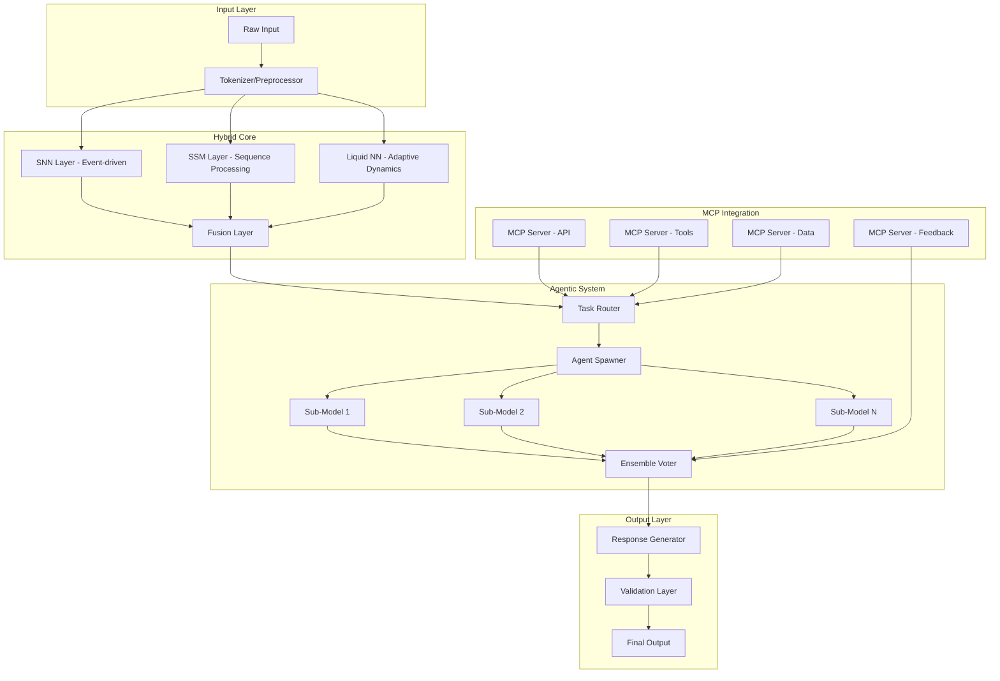
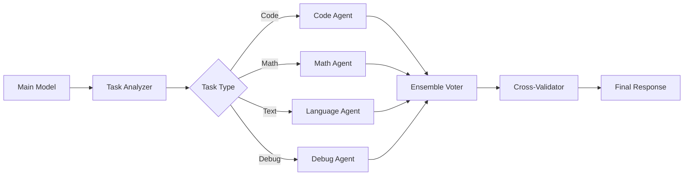
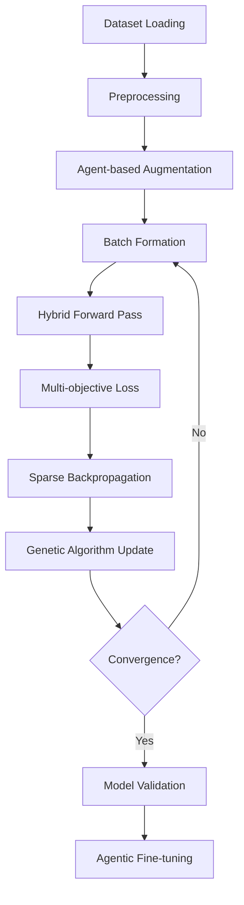
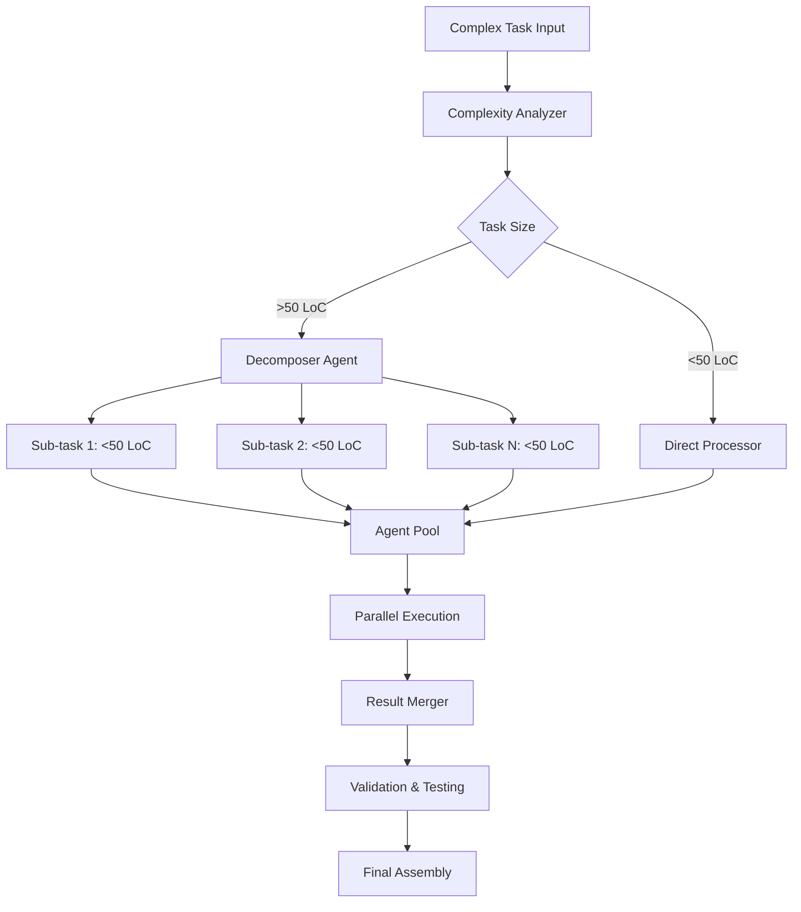
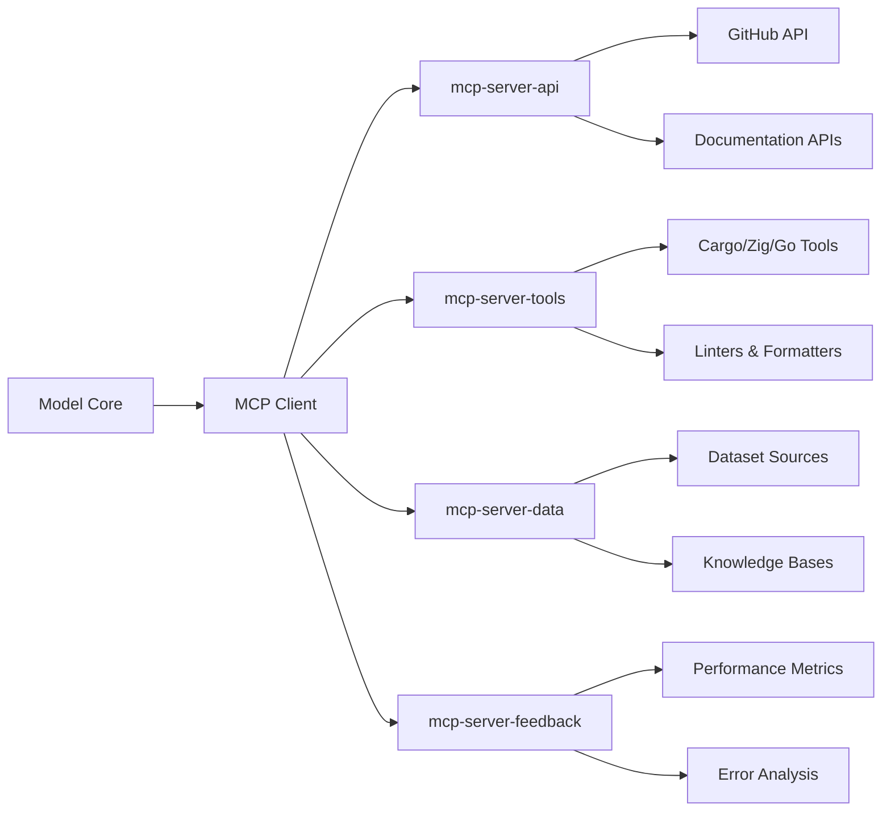
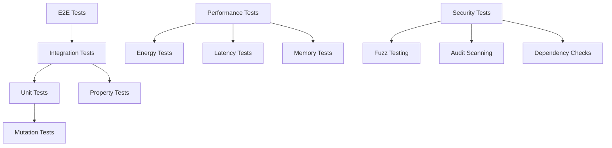
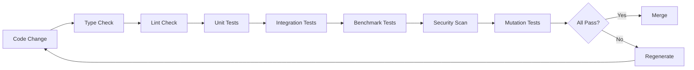
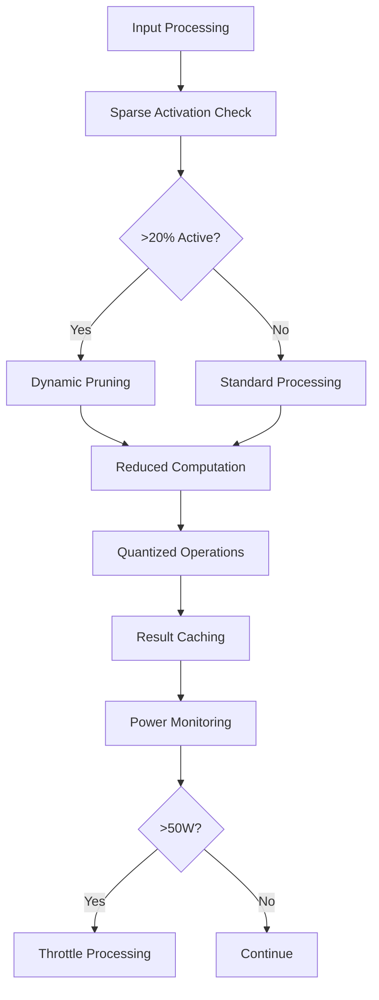
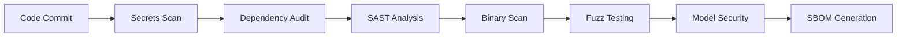

# Hyper-Efficient AI Model Design

## Overview

This project aims to develop a revolutionary hyper-small, ultra-fast AI model that rivals 2025-era models (Claude, GPT, DeepSeek, Kimi, Qwen) in versatility while running efficiently on consumer CPUs. The model uses a novel non-transformer hybrid architecture combining Spiking Neural Networks (SNNs), State-Space Models (SSMs), and Liquid Neural Networks with agentic capabilities.

### Key Specifications
- **Parameters**: <100M (max 1B)
- **Inference Power**: 10-50W on consumer CPUs
- **Training**: Single RTX 2070 Ti, <24 hours
- **Latency**: <100ms simple tasks, <500ms complex tasks
- **Error Rate**: <1% via ensemble voting
- **Dataset Size**: <1GB total

## Technology Stack & Dependencies

### Primary Languages
- **Rust**: Core model, training logic, utilities (safety & performance)
- **Zig**: Performance-critical kernels (SNN operations, matrix computations)
- **Go**: MCP interfaces and concurrency management

### Key Dependencies
```
Rust Crates:
- burn: Deep learning framework
- candle: PyTorch-like tensor operations
- neuroflow: Neural network primitives
- rayon: Data parallelism
- tokio: Async runtime
- serde: Serialization

Zig Libraries:
- Metaphor: Neural network framework
- Zigrad: Automatic differentiation

Go Modules:
- gonum: Numerical computing
- gorgonia: Machine learning
```

## Architecture

### Hybrid Neural Architecture



### Component Architecture

#### 1. Core Neural Components

**Spiking Neural Networks (SNNs)**
- Event-driven processing for energy efficiency
- Binary spike trains reduce computation
- Temporal dynamics for sequence understanding
- 10-20% sparse activation

**State-Space Models (SSMs)**
- Mamba-style architecture for long sequences
- Linear scaling with sequence length
- Efficient convolution operations
- Sub-quadratic memory usage

**Liquid Neural Networks**
- Adaptive time constants
- Dynamic neuron behavior
- Continuous learning capability
- Plasticity for new domains

#### 2. Agentic Architecture



### Model Parameters Distribution

| Component | Parameters | Percentage |
|-----------|------------|------------|
| SNN Layers | 30M | 30% |
| SSM Layers | 40M | 40% |
| Liquid NN | 20M | 20% |
| Fusion/Output | 10M | 10% |
| **Total** | **100M** | **100%** |

## Core Features

### 1. Multi-Domain Expertise
- **Software Development**: Code generation, debugging, refactoring, documentation
- **Project Management**: Task breakdown, milestone tracking, workflow automation
- **Context Engineering**: Dynamic context pruning, relevance scoring
- **Prompt Engineering**: Vague input parsing, requirement clarification

### 2. Zero-Hallucination System
- Ensemble voting across sub-models
- Real-time validation (type-checking, linting)
- Cross-verification protocols
- Confidence scoring with rejection sampling

### 3. Agentic Capabilities
- Dynamic sub-model spawning
- Parallel task execution
- Recursive task decomposition
- Self-improvement via genetic algorithms

### 4. MCP Integration
- External tool delegation
- Data source integration
- Feedback loop automation
- Cache-enabled responses

## Data Models & Training Strategy

### Training Datasets

| Dataset | Size | Purpose | Format |
|---------|------|---------|---------|
| HumanEval | 1MB | Code evaluation | JSON |
| TinyStories | 10MB | Language understanding | Parquet |
| GSM8K (subset) | 500KB | Mathematical reasoning | JSON |
| BabyLM | 100MB | Language modeling | Text |
| MiniPile | 200MB | General knowledge | Parquet |
| Synthetic Code | 50MB | Code generation | JSON |

### Training Pipeline



### Loss Function Design
```
Total Loss = α₁ * Task_Loss + α₂ * Energy_Loss + α₃ * Sparsity_Loss + α₄ * Consistency_Loss

Where:
- Task_Loss: Cross-entropy for primary tasks
- Energy_Loss: Penalty for high activation
- Sparsity_Loss: Promotes sparse activations
- Consistency_Loss: Ensemble agreement penalty
```

## Business Logic Layer

### Task Decomposition Engine



### Agent Spawning Strategy

1. **Task Analysis**: Classify input by domain and complexity
2. **Resource Allocation**: Assign optimal sub-models based on task type
3. **Parallel Execution**: Spawn agents using Rust rayon or Go goroutines
4. **Result Synthesis**: Ensemble voting with confidence weighting
5. **Quality Assurance**: Cross-validation and error detection

### Context Management

- **Dynamic Pruning**: Remove irrelevant context based on attention scores
- **Hierarchical Storage**: Recent context in memory, historical in MCP cache
- **Relevance Scoring**: Weight context by task similarity and recency
- **Compression**: Use SSM compression for long-term context storage

## API Integration Layer

### MCP Server Architecture



### External Tool Integration

| Tool Category | Examples | MCP Server | Purpose |
|---------------|----------|------------|---------|
| Build Tools | cargo, zig build, go build | mcp-server-tools | Code compilation |
| Linters | clippy, zig fmt, go vet | mcp-server-tools | Code quality |
| Version Control | git commands | mcp-server-tools | Repository management |
| APIs | GitHub, StackOverflow | mcp-server-api | External data |
| Datasets | HuggingFace, Papers | mcp-server-data | Training data |

### Caching Strategy

- **24-hour Cache**: Store MCP responses in `.cache/mcp/`
- **Fixtures**: Commit reproducible responses in `__fixtures__/mcp/YYYY-MM-DD/`
- **Offline Fallback**: Internal logic when MCP unavailable
- **Cache Invalidation**: Based on request parameters and timestamps

## Testing Strategy

### Testing Pyramid



### Coverage Requirements

| Test Type | Target | Tool | Language |
|-----------|--------|------|----------|
| Unit Coverage | 100% | cargo-tarpaulin | Rust |
| Unit Coverage | 100% | zig test | Zig |
| Unit Coverage | 100% | go test | Go |
| Mutation Score | ≥80% | cargo-mutants | Rust |
| Property Tests | Critical paths | proptest | Rust |
| Fuzz Tests | Input validation | cargo-fuzz | Rust |

### Benchmark Specifications

- **Inference Latency**: p95 <100ms on Intel i7 CPU
- **Energy Consumption**: <50W during inference
- **Training Time**: <24 hours on RTX 2070 Ti
- **Memory Usage**: <8GB VRAM during training
- **Accuracy**: >95% on HumanEval, GSM8K benchmarks

### Validation Pipeline



## Directory Structure

```
src/
├── main.rs                 # Rust entry point
├── model/                  # Core AI model (Rust)
│   ├── core.rs            # SNN-SSM-Liquid hybrid
│   ├── agentic.rs         # Agent spawning/merging
│   ├── mcp.rs             # MCP client logic
│   ├── fusion.rs          # Component fusion layer
│   └── validation.rs      # Output validation
├── training/               # Training logic (Rust)
│   ├── datasets.rs        # Dataset handlers
│   ├── trainer.rs         # Training loop
│   ├── genetic.rs         # Genetic algorithms
│   └── metrics.rs         # Performance tracking
├── kernels/                # Performance kernels (Zig)
│   ├── snn.zig           # Spiking neural ops
│   ├── matrix.zig        # Matrix operations
│   ├── sparse.zig        # Sparse computations
│   └── quantize.zig      # 4-bit quantization
├── mcp/                    # MCP interfaces (Go)
│   ├── api.go            # External API calls
│   ├── tools.go          # Tool integration
│   ├── data.go           # Data source access
│   └── feedback.go       # Feedback loops
├── utils/                  # Shared utilities (Rust)
│   ├── perf.rs           # Performance monitoring
│   ├── schemas.rs        # Data validation
│   ├── config.rs         # Configuration management
│   └── logging.rs        # Structured logging
└── tests/                  # Comprehensive tests
    ├── integration/        # E2E tests
    ├── fixtures/          # Test data
    └── benchmarks/        # Performance tests

Config Files:
├── Cargo.toml             # Rust dependencies
├── build.zig              # Zig build configuration
├── go.mod                 # Go module definition
├── Dockerfile             # Multi-stage container
├── docker-compose.yml     # Training environment
├── .qoddi.yaml           # Qoddi CI/CD config
└── __fixtures__/          # Reproducible data
    ├── datasets/          # Training data
    └── mcp/              # MCP responses
```

## Performance Optimization

### Efficiency Strategies

1. **Sparse Activations**: Only 10-20% neurons active per inference
2. **4-bit Quantization**: Reduce memory and computation requirements
3. **Dynamic Pruning**: Remove unused connections during inference
4. **Batch Optimization**: Optimal batch sizes for CPU inference
5. **Memory Pooling**: Reuse allocations to minimize GC overhead

### Energy Optimization



### Parallelization Strategy

- **Model Parallelism**: Split layers across CPU cores
- **Agent Parallelism**: Concurrent sub-model execution
- **Pipeline Parallelism**: Overlap inference stages
- **Data Parallelism**: Batch processing optimization

## Security & Validation

### Security Pipeline



### Validation Layers

1. **Input Validation**: Schema validation for all inputs
2. **Type Safety**: Compile-time checks in Rust/Zig
3. **Runtime Checks**: Bounds checking and error handling
4. **Output Validation**: Cross-reference with known good outputs
5. **Security Scanning**: Regular dependency and binary scans

### Threat Mitigation

- **Adversarial Inputs**: Robust input sanitization
- **Model Poisoning**: Dataset validation and anomaly detection
- **Supply Chain**: Dependency pinning and verification
- **Runtime Security**: Sandboxed execution environment

## Deployment Strategy

### Container Architecture

```dockerfile
# Multi-stage build for efficiency
FROM rust:1.80 AS rust-builder
FROM ziglang/zig:0.13 AS zig-builder  
FROM golang:1.23 AS go-builder
FROM gcr.io/distroless/cc-debian12 AS runtime

# Non-root execution
USER 1000:1000
```

### Deployment Targets

1. **Local Development**: Direct binary execution
2. **Qoddi Platform**: Containerized deployment with CI/CD
3. **Edge Devices**: Cross-compiled ARM binaries
4. **Cloud Services**: Docker containers with auto-scaling

### Monitoring & Observability

- **Performance Metrics**: Latency, throughput, energy consumption
- **Error Tracking**: Structured logging with error aggregation
- **Model Metrics**: Accuracy, confidence scores, hallucination rates
- **Resource Usage**: CPU, memory, disk utilization
- **Health Checks**: Automated system health monitoring