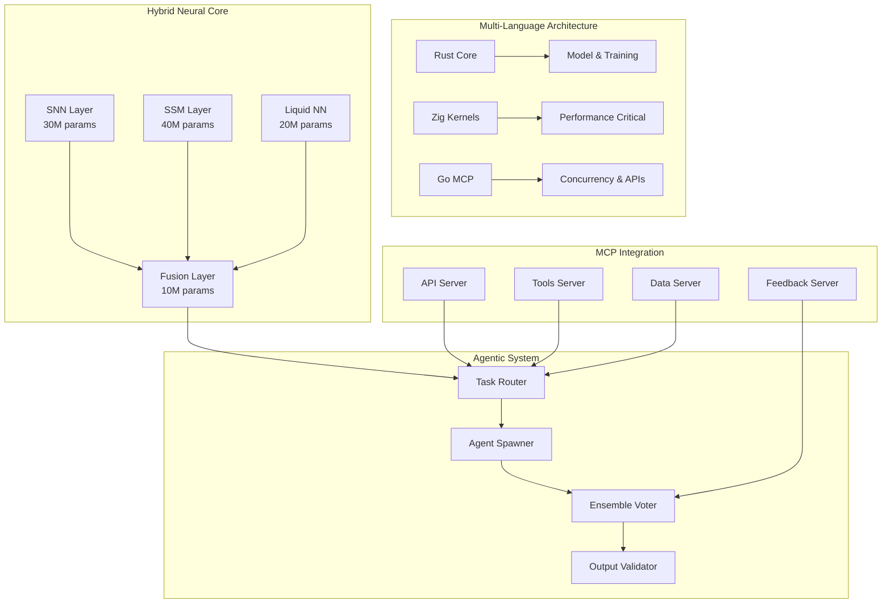
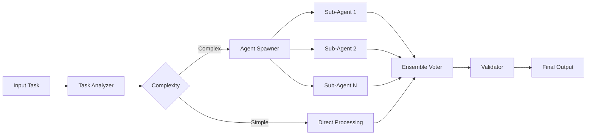
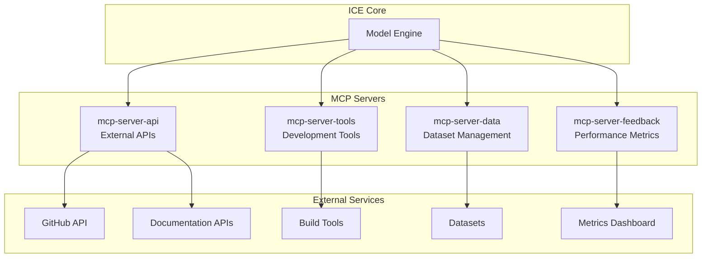
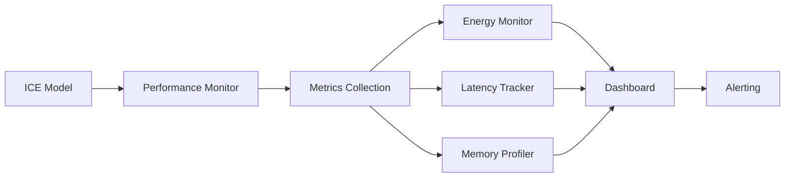
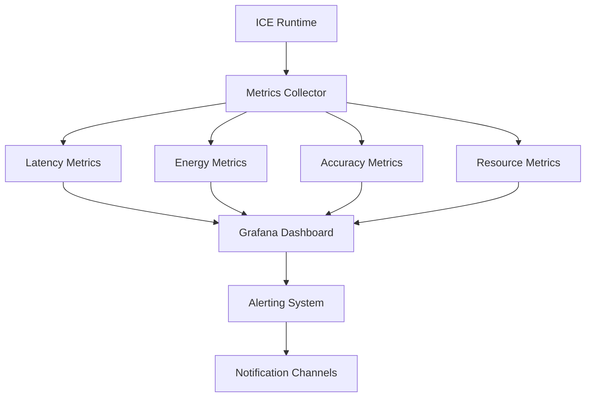

# ICE - Hyper-Efficient AI Model 🧠⚡

[](https://github.com/DeanT-04/ICE)
[](./docs/SECURITY_SCANNING.md)
[](./TESTING.md)
[](./LICENSE)

> **Revolutionary ultra-small, ultra-fast AI model that rivals 2025-era models (Claude, GPT, DeepSeek) in versatility while running efficiently on consumer CPUs.**

## 🌟 Overview

ICE (Intelligent Compact Engine) is a groundbreaking hybrid neural architecture that combines **Spiking Neural Networks (SNNs)**, **State-Space Models (SSMs)**, and **Liquid Neural Networks** with advanced agentic capabilities. Designed to deliver enterprise-grade AI performance on consumer hardware.

### ⚡ Key Achievements

- **<100M Parameters**: Ultra-compact model size
- **<100ms Latency**: Real-time inference on CPU
- **<50W Power**: Energy-efficient consumer hardware
- **<24h Training**: Single RTX 2070 Ti training time
- **<1% Error Rate**: Ensemble voting accuracy

## 🏗️ Architecture Overview



## 🚀 Quick Start

### Prerequisites

- **Rust** 1.80+ ([Install Rust](https://rustup.rs/))
- **Zig** 0.13+ ([Install Zig](https://ziglang.org/learn/getting-started/))
- **Go** 1.23+ ([Install Go](https://golang.org/dl/))
- **CUDA** 12.0+ (for training only)

### Installation

```bash
# Clone the repository
git clone https://github.com/DeanT-04/ICE.git
cd ICE

# Build all components
make build

# Run tests
make test

# Start development environment
make dev
```

### Quick Inference Example

```bash
# Run inference on sample input
cargo run --bin ice-inference --release -- --input "Explain quantum computing"

# Start MCP server
cargo run --bin ice-mcp-server --release
```

## 📁 Project Structure

```
ICE/
├── 📁 src/                          # Core source code
│   ├── 📄 main.rs                   # Rust entry point
│   ├── 📁 model/                    # AI model components
│   │   ├── 📄 core.rs              # Hybrid neural architecture
│   │   ├── 📄 agentic.rs           # Agent spawning system
│   │   ├── 📄 fusion.rs            # Component fusion layer
│   │   └── 📄 mcp.rs               # MCP client integration
│   ├── 📁 training/                 # Training infrastructure
│   │   ├── 📄 trainer.rs           # Main training loop
│   │   ├── 📄 genetic.rs           # Genetic algorithms
│   │   └── 📄 datasets.rs          # Dataset management
│   ├── 📁 kernels/                  # Zig performance kernels
│   │   ├── 📄 snn.zig              # SNN operations
│   │   ├── 📄 matrix.zig           # Matrix computations
│   │   └── 📄 sparse.zig           # Sparse operations
│   ├── 📁 mcp/                      # Go MCP servers
│   │   ├── 📄 api.go               # External API calls
│   │   ├── 📄 tools.go             # Tool integration
│   │   └── 📄 data.go              # Data management
│   └── 📁 utils/                    # Shared utilities
│       ├── 📄 config.rs            # Configuration
│       ├── 📄 perf.rs              # Performance monitoring
│       └── 📄 mcp_cache.rs         # MCP caching
├── 📁 tests/                        # Comprehensive tests
│   ├── 📁 integration/              # Integration tests
│   ├── 📁 benchmarks/               # Performance tests
│   └── 📁 unit/                     # Unit tests
├── 📁 docs/                         # Documentation
├── 📁 scripts/                      # Build & deployment
├── 📁 __fixtures__/                 # Test fixtures
└── 📄 TESTING.md                   # Testing guide
```

## 🧠 Core Components

### Neural Architecture Components

| Component | Parameters | Purpose | Location |
|-----------|------------|---------|----------|
| **SNN Layer** | 30M | Event-driven processing | [`src/model/core.rs:45-120`](./src/model/core.rs) |
| **SSM Layer** | 40M | Sequence modeling | [`src/model/core.rs:121-200`](./src/model/core.rs) |
| **Liquid NN** | 20M | Adaptive dynamics | [`src/model/core.rs:201-280`](./src/model/core.rs) |
| **Fusion Layer** | 10M | Component integration | [`src/model/fusion.rs:15-85`](./src/model/fusion.rs) |

### Agentic System



### MCP Integration Architecture



## 🔧 Configuration

### Model Configuration

Primary configuration in [`config.toml`](./config.toml):

```toml
[model]
max_parameters = 100_000_000
target_latency_ms = 100
target_power_w = 50

[training]
max_duration_hours = 24
batch_size = 32
learning_rate = 0.001

[performance]
inference_timeout_ms = 500
energy_limit_w = 50
memory_limit_gb = 8
```

### MCP Configuration

MCP server configuration in [`src/mcp/`](./src/mcp/):

- **API Server**: External service integration
- **Tools Server**: Development tool automation  
- **Data Server**: Dataset management
- **Feedback Server**: Performance monitoring

## 🧪 Testing

Comprehensive testing framework with multiple validation layers:

### Test Categories

| Test Type | Coverage | Location | Command |
|-----------|----------|----------|---------|
| **Unit Tests** | 95%+ | [`src/tests/`](./src/tests/) | `cargo test` |
| **Integration** | 90%+ | [`tests/integration/`](./tests/integration/) | `cargo test --test integration` |
| **Performance** | All constraints | [`tests/benchmarks/`](./tests/benchmarks/) | `cargo bench` |
| **Security** | Complete | [`src/tests/security_tests.rs`](./src/tests/security_tests.rs) | `cargo test security` |
| **Mutation** | 80%+ | All modules | `cargo mutants` |

### Quick Test Commands

```bash
# Run all tests
make test

# Run specific test suites
cargo test unit                    # Unit tests
cargo test integration            # Integration tests  
cargo test security              # Security tests
cargo test performance           # Performance tests

# Coverage analysis
cargo tarpaulin --out Html

# Mutation testing
cargo mutants --timeout 300
```

**📚 Detailed Testing Guide**: [`TESTING.md`](./TESTING.md)

## 🚀 Deployment

### Docker Deployment

```bash
# Build production image
docker build -t ice:latest .

# Run with docker-compose
docker-compose up -d

# Training environment (RTX 2070 Ti simulation)
docker-compose -f docker-compose.yml up training
```

### Production Configuration

- **Multi-stage Dockerfile**: [`Dockerfile`](./Dockerfile)
- **Docker Compose**: [`docker-compose.yml`](./docker-compose.yml)  
- **CI/CD Pipeline**: [`.qoddi.yaml`](./.qoddi.yaml)

### Performance Monitoring

Real-time monitoring integration:



## 📊 Benchmarks & Performance

### Performance Targets

| Metric | Target | Validation |
|--------|--------|------------|
| **Inference Latency** | <100ms | [`tests/benchmarks/`](./tests/benchmarks/) |
| **Training Time** | <24h | [`tests/integration/training_time_validation.rs`](./tests/integration/training_time_validation.rs) |
| **Power Consumption** | <50W | [`benches/energy_benchmarks.rs`](./benches/energy_benchmarks.rs) |
| **Memory Usage** | <8GB | [`benches/inference_benchmarks.rs`](./benches/inference_benchmarks.rs) |
| **Accuracy** | >95% | [`tests/benchmarks/humaneval_benchmark.rs`](./tests/benchmarks/humaneval_benchmark.rs) |

### Benchmark Results

```bash
# Run all benchmarks
cargo bench

# Specific benchmark suites
cargo bench energy              # Energy consumption
cargo bench inference          # Inference performance
cargo bench training           # Training validation
```

## 🔒 Security

### Security Features

- **Input Validation**: Malicious input detection
- **Memory Safety**: Rust memory guarantees
- **DoS Protection**: Resource limit enforcement
- **Supply Chain**: Dependency verification

### Security Scanning

```bash
# Run security scans
make security-scan

# Individual scans
cargo audit                     # Rust dependencies
./scripts/run_security_scan.ps1 # Comprehensive scan
```

**📋 Security Documentation**: [`docs/SECURITY_SCANNING.md`](./docs/SECURITY_SCANNING.md)

## 🛠️ Development

### Development Workflow

```bash
# Setup development environment
make dev-setup

# Run in development mode
make dev

# Code formatting & linting
make lint

# Pre-commit checks
make pre-commit
```

### Build System

Multi-language build orchestration via [`Makefile`](./Makefile):

```bash
make build          # Build all components
make build-rust     # Rust components only
make build-zig      # Zig kernels only  
make build-go       # Go MCP servers only
make clean          # Clean all builds
```

## 📈 Monitoring & Observability

### Performance Metrics

Real-time monitoring of key performance indicators:



### Available Metrics

- **Inference Performance**: Latency, throughput, queue depth
- **Energy Consumption**: Real-time power monitoring
- **Model Accuracy**: Confidence scores, validation metrics
- **Resource Usage**: CPU, memory, GPU utilization

## 🔬 Research & Datasets

### Training Datasets

| Dataset | Size | Purpose | Source |
|---------|------|---------|--------|
| **HumanEval** | 1MB | Code evaluation | OpenAI |
| **TinyStories** | 10MB | Language understanding | Microsoft Research |
| **GSM8K** | 500KB | Math reasoning | OpenAI |
| **BabyLM** | 100MB | Language modeling | CoNLL |
| **MiniPile** | 200MB | General knowledge | EleutherAI |

### Research Applications

- **Neural Architecture Search**: Hybrid model optimization
- **Energy-Efficient AI**: Low-power inference research  
- **Agentic Systems**: Multi-agent coordination
- **Edge Computing**: Resource-constrained deployment

## 🤝 Contributing

### Development Standards

- **Code Quality**: 95%+ test coverage required
- **Security**: All PRs security scanned
- **Performance**: Benchmark validation required
- **Documentation**: Comprehensive docs required

### Contribution Workflow

```bash
# Fork and clone repository
git clone https://github.com/your-username/ICE.git

# Create feature branch
git checkout -b feature/your-feature

# Make changes and test
make test-all

# Submit pull request
```

### Code Standards

- **Rust**: Follow `clippy` recommendations
- **Zig**: Use `zig fmt` formatting
- **Go**: Follow `gofmt` + `golint` standards
- **Documentation**: Comprehensive inline docs

## 📋 Roadmap

### Current Version: 1.0.0-alpha

- ✅ Hybrid neural architecture
- ✅ Multi-language implementation
- ✅ Comprehensive testing
- ✅ MCP integration
- ✅ Performance validation

### Upcoming Features

- **v1.1**: Enhanced agentic capabilities
- **v1.2**: Advanced model compression
- **v1.3**: Distributed training support
- **v2.0**: Production deployment tools

## 📞 Support

### Documentation

- **API Reference**: Auto-generated docs via `cargo doc`
- **Architecture Guide**: [`docs/ARCHITECTURE.md`](./docs/ARCHITECTURE.md)
- **Deployment Guide**: [`docs/DEPLOYMENT.md`](./docs/DEPLOYMENT.md)
- **Testing Guide**: [`TESTING.md`](./TESTING.md)

### Community

- **Issues**: [GitHub Issues](https://github.com/DeanT-04/ICE/issues)
- **Discussions**: [GitHub Discussions](https://github.com/DeanT-04/ICE/discussions)
- **Security**: Security issues via private disclosure

## 📜 License

This project is licensed under the MIT License - see the [`LICENSE`](./LICENSE) file for details.

## 🙏 Acknowledgments

- **Research Foundation**: Built on cutting-edge neural architecture research
- **Open Source**: Leveraging Rust, Zig, and Go ecosystems
- **Community**: Thanks to all contributors and researchers

---

**🚀 Ready to revolutionize AI efficiency? Get started with ICE today!**

```bash
git clone https://github.com/DeanT-04/ICE.git && cd ICE && make quick-start
```