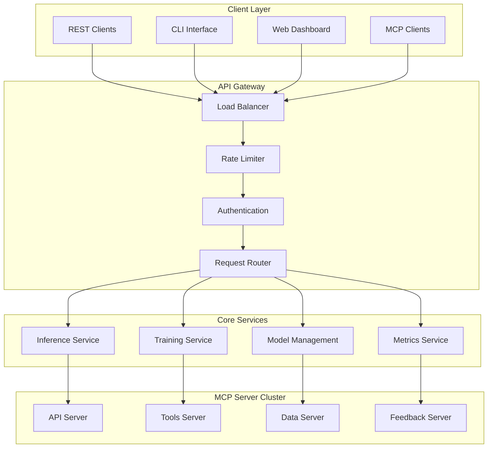
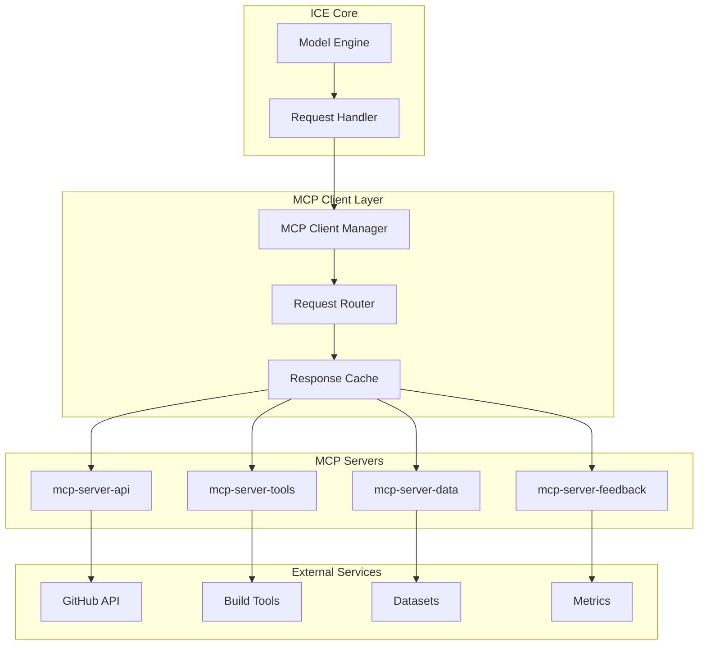
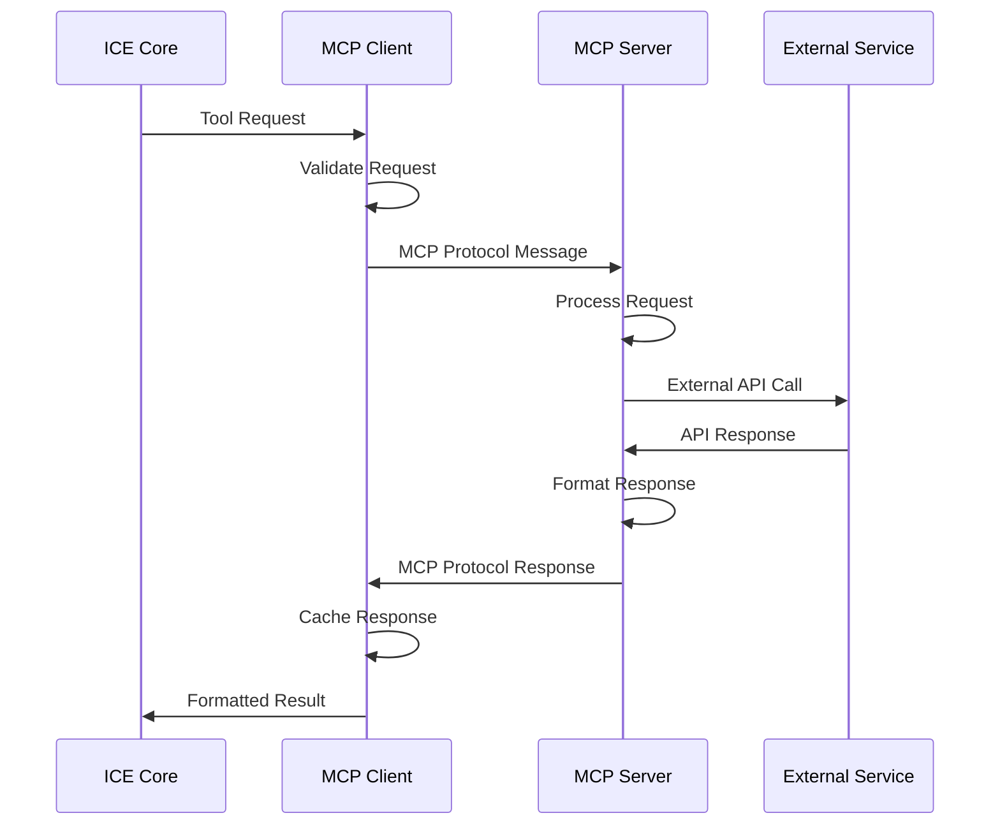
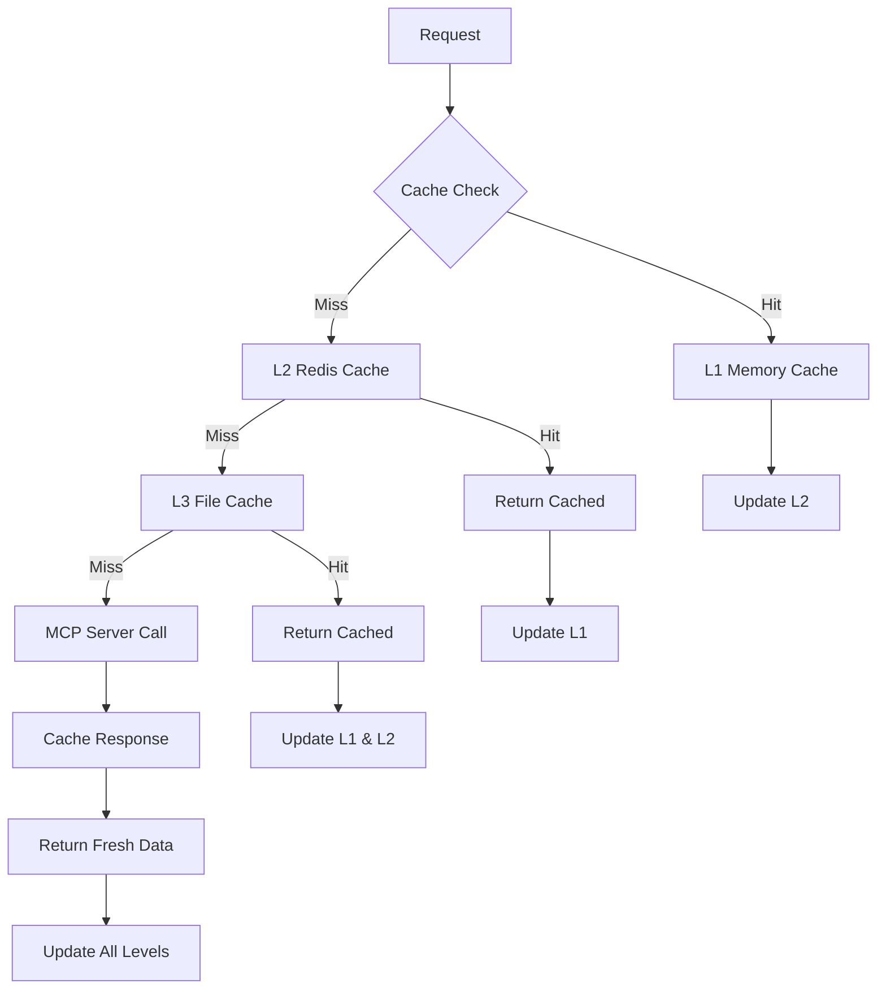
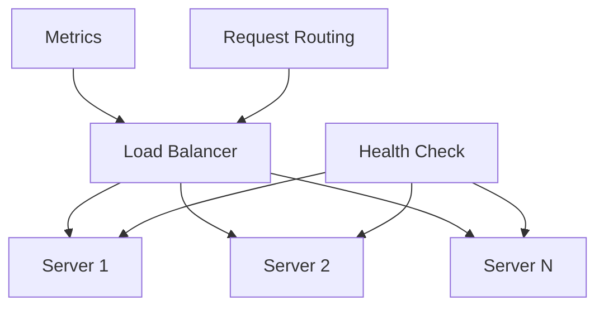
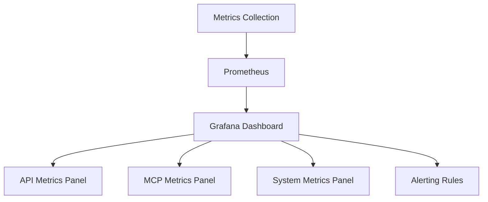

# API & MCP Integration Documentation 🔌

## Overview

ICE provides comprehensive API access through multiple interfaces, with deep Model Context Protocol (MCP) integration for external tool and data source connectivity. This document covers all API endpoints, MCP server configurations, and integration patterns.

## API Architecture

### API Gateway Architecture



## REST API Endpoints

### Core Inference API

#### POST `/api/v1/inference`

**Description**: Execute model inference on input data

**Request Body**:
```json
{
  "input": "string",
  "model_config": {
    "max_tokens": 1000,
    "temperature": 0.7,
    "agent_mode": "auto|single|ensemble"
  },
  "options": {
    "include_confidence": true,
    "enable_validation": true,
    "timeout_ms": 5000
  }
}
```

**Response**:
```json
{
  "output": "string",
  "confidence": 0.95,
  "processing_time_ms": 87,
  "agent_breakdown": {
    "code_agent": 0.92,
    "math_agent": 0.88,
    "language_agent": 0.97
  },
  "metadata": {
    "model_version": "1.0.0",
    "energy_consumed_w": 23.5,
    "memory_used_mb": 1024
  }
}
```

#### GET `/api/v1/models`

**Description**: List available models and configurations

**Response**:
```json
{
  "models": [
    {
      "id": "ice-hybrid-v1",
      "name": "ICE Hybrid Neural Model",
      "version": "1.0.0",
      "parameters": 100000000,
      "capabilities": ["code", "math", "language", "debug"],
      "status": "active"
    }
  ]
}
```

#### GET `/api/v1/health`

**Description**: Health check endpoint

**Response**:
```json
{
  "status": "healthy",
  "version": "1.0.0",
  "uptime_seconds": 86400,
  "components": {
    "neural_core": "healthy",
    "mcp_servers": "healthy",
    "cache": "healthy"
  },
  "performance": {
    "avg_latency_ms": 95,
    "current_power_w": 42,
    "memory_usage_mb": 6144
  }
}
```

### Training API

#### POST `/api/v1/training/start`

**Description**: Start model training with specified configuration

**Request Body**:
```json
{
  "dataset": "humaneval",
  "config": {
    "epochs": 10,
    "batch_size": 32,
    "learning_rate": 0.001,
    "optimization": "genetic"
  },
  "constraints": {
    "max_duration_hours": 24,
    "max_power_w": 150,
    "target_accuracy": 0.95
  }
}
```

#### GET `/api/v1/training/status/{job_id}`

**Description**: Get training job status

**Response**:
```json
{
  "job_id": "train_001",
  "status": "running",
  "progress": 0.45,
  "metrics": {
    "current_epoch": 4,
    "loss": 0.23,
    "accuracy": 0.87,
    "estimated_completion": "2024-01-15T10:30:00Z"
  },
  "resource_usage": {
    "power_w": 145,
    "memory_gb": 7.2,
    "gpu_utilization": 0.89
  }
}
```

### Model Management API

#### GET `/api/v1/models/{model_id}/metrics`

**Description**: Get detailed model performance metrics

**Response**:
```json
{
  "model_id": "ice-hybrid-v1",
  "performance_metrics": {
    "inference_latency": {
      "p50": 78,
      "p95": 145,
      "p99": 220
    },
    "accuracy_metrics": {
      "humaneval": 0.94,
      "gsm8k": 0.91,
      "overall": 0.93
    },
    "energy_metrics": {
      "avg_power_w": 38,
      "peak_power_w": 47,
      "efficiency_ops_per_watt": 2500
    }
  }
}
```

## MCP Server Integration

### MCP Server Architecture



### MCP Server Configurations

#### API Server (`mcp-server-api`)

**Location**: [`src/mcp/api.go`](../src/mcp/api.go)

**Purpose**: External API integration and web service access

**Configuration**:
```json
{
  "name": "mcp-server-api",
  "version": "1.0.0",
  "endpoints": {
    "github": {
      "base_url": "https://api.github.com",
      "rate_limit": 5000,
      "timeout_ms": 3000
    },
    "documentation": {
      "base_url": "https://docs.rs",
      "cache_ttl": 3600
    }
  },
  "authentication": {
    "github_token": "${GITHUB_TOKEN}",
    "api_keys": "${API_KEYS}"
  }
}
```

**Available Tools**:
- `github_search`: Search GitHub repositories and code
- `docs_lookup`: Look up documentation
- `web_search`: General web search functionality
- `api_call`: Generic HTTP API calls

#### Tools Server (`mcp-server-tools`)

**Location**: [`src/mcp/tools.go`](../src/mcp/tools.go)

**Purpose**: Development tool integration and automation

**Configuration**:
```json
{
  "name": "mcp-server-tools",
  "version": "1.0.0",
  "tool_registry": {
    "rust": {
      "cargo": "/usr/local/bin/cargo",
      "rustc": "/usr/local/bin/rustc",
      "clippy": "/usr/local/bin/cargo-clippy"
    },
    "zig": {
      "zig": "/usr/local/bin/zig"
    },
    "go": {
      "go": "/usr/local/bin/go",
      "gofmt": "/usr/local/bin/gofmt"
    }
  }
}
```

**Available Tools**:
- `cargo_build`: Build Rust projects
- `cargo_test`: Run Rust tests
- `zig_build`: Build Zig projects
- `go_build`: Build Go projects
- `lint_check`: Run code linting
- `format_code`: Format source code

#### Data Server (`mcp-server-data`)

**Location**: [`src/mcp/data.go`](../src/mcp/data.go)

**Purpose**: Dataset management and data source integration

**Configuration**:
```json
{
  "name": "mcp-server-data",
  "version": "1.0.0",
  "data_sources": {
    "local": {
      "datasets_path": "./datasets",
      "cache_path": "./.cache/datasets"
    },
    "remote": {
      "huggingface": {
        "base_url": "https://huggingface.co/datasets",
        "token": "${HF_TOKEN}"
      },
      "github": {
        "base_url": "https://github.com",
        "token": "${GITHUB_TOKEN}"
      }
    }
  }
}
```

**Available Tools**:
- `load_dataset`: Load local or remote datasets
- `download_dataset`: Download datasets from remote sources
- `preprocess_data`: Data preprocessing and transformation
- `validate_data`: Data quality validation
- `cache_data`: Cache processed data

#### Feedback Server (`mcp-server-feedback`)

**Location**: [`src/mcp/feedback.go`](../src/mcp/feedback.go)

**Purpose**: Performance monitoring and feedback collection

**Configuration**:
```json
{
  "name": "mcp-server-feedback",
  "version": "1.0.0",
  "metrics_config": {
    "collection_interval_ms": 1000,
    "storage_backend": "prometheus",
    "retention_days": 30
  },
  "alerting": {
    "threshold_latency_ms": 150,
    "threshold_power_w": 55,
    "threshold_error_rate": 0.05
  }
}
```

**Available Tools**:
- `collect_metrics`: Collect performance metrics
- `store_feedback`: Store user feedback
- `analyze_performance`: Analyze performance trends
- `generate_report`: Generate performance reports
- `trigger_alert`: Trigger performance alerts

## MCP Communication Protocols

### Request/Response Flow



### MCP Message Format

#### Tool Request
```json
{
  "jsonrpc": "2.0",
  "id": "req_001",
  "method": "tools/call",
  "params": {
    "name": "github_search",
    "arguments": {
      "query": "rust neural networks",
      "language": "rust",
      "sort": "stars"
    }
  }
}
```

#### Tool Response
```json
{
  "jsonrpc": "2.0",
  "id": "req_001",
  "result": {
    "content": [
      {
        "type": "text",
        "text": "Found 42 repositories matching your query"
      },
      {
        "type": "resource",
        "resource": {
          "uri": "github://candle-core/candle",
          "name": "Candle Neural Network Framework",
          "description": "Minimalist ML framework for Rust"
        }
      }
    ]
  }
}
```

## Caching Strategy

### Multi-Level Caching



### Cache Configuration

**L1 - Memory Cache**:
```rust
// Location: src/utils/mcp_cache.rs:25-45
pub struct MemoryCache {
    capacity: usize,
    ttl: Duration,
    entries: HashMap<String, CacheEntry>,
}
```

**L2 - Redis Cache** (Optional):
```json
{
  "redis": {
    "url": "redis://localhost:6379",
    "ttl_seconds": 86400,
    "max_memory": "256mb"
  }
}
```

**L3 - File System Cache**:
```rust
// Location: src/utils/mcp_cache.rs:85-120
pub struct FileCache {
    cache_dir: PathBuf,
    max_size_gb: u64,
    compression: bool,
}
```

## Authentication & Security

### API Authentication

#### Bearer Token Authentication
```http
POST /api/v1/inference
Authorization: Bearer your-api-token-here
Content-Type: application/json
```

#### API Key Authentication
```http
POST /api/v1/inference
X-API-Key: your-api-key-here
Content-Type: application/json
```

### MCP Security

#### Server Authentication
```json
{
  "mcp_servers": {
    "api": {
      "auth_type": "token",
      "token": "${MCP_API_TOKEN}"
    },
    "tools": {
      "auth_type": "certificate",
      "cert_path": "./certs/tools-server.pem"
    }
  }
}
```

#### Request Signing
```go
// Location: src/mcp/api.go:156-180
func signRequest(request *MCPRequest, secret string) string {
    h := hmac.New(sha256.New, []byte(secret))
    h.Write([]byte(request.Serialize()))
    return hex.EncodeToString(h.Sum(nil))
}
```

## Error Handling

### API Error Responses

#### Standard Error Format
```json
{
  "error": {
    "code": "INFERENCE_TIMEOUT",
    "message": "Inference request timed out after 5000ms",
    "details": {
      "timeout_ms": 5000,
      "partial_result": null,
      "retry_suggested": true
    },
    "timestamp": "2024-01-15T10:30:00Z",
    "request_id": "req_12345"
  }
}
```

#### Error Codes

| Code | HTTP Status | Description |
|------|-------------|-------------|
| `INVALID_INPUT` | 400 | Invalid request format or parameters |
| `UNAUTHORIZED` | 401 | Authentication required or invalid |
| `RATE_LIMITED` | 429 | Too many requests |
| `INFERENCE_TIMEOUT` | 408 | Request processing timeout |
| `MODEL_UNAVAILABLE` | 503 | Model temporarily unavailable |
| `INTERNAL_ERROR` | 500 | Internal server error |

### MCP Error Handling

#### MCP Error Response
```json
{
  "jsonrpc": "2.0",
  "id": "req_001",
  "error": {
    "code": -32603,
    "message": "Internal error",
    "data": {
      "type": "EXTERNAL_API_FAILURE",
      "service": "github",
      "details": "GitHub API rate limit exceeded"
    }
  }
}
```

## Performance Optimization

### Request Optimization


### Connection Pooling

```go
// Location: src/mcp/api.go:45-75
type ConnectionPool struct {
    servers map[string]*ServerConnection
    maxConnections int
    timeout time.Duration
    retryAttempts int
}
```

### Load Balancing



## Integration Examples

### Basic Inference Integration

```rust
// Location: examples/basic_inference.rs
use ice_core::InferenceClient;

#[tokio::main]
async fn main() -> Result<(), Box<dyn std::error::Error>> {
    let client = InferenceClient::new("http://localhost:8080")?;
    
    let response = client.infer(InferenceRequest {
        input: "Write a Rust function to calculate fibonacci".to_string(),
        model_config: ModelConfig::default(),
        options: InferenceOptions {
            include_confidence: true,
            enable_validation: true,
            timeout_ms: Some(5000),
        },
    }).await?;
    
    println!("Output: {}", response.output);
    println!("Confidence: {}", response.confidence);
    
    Ok(())
}
```

### MCP Tool Integration

```go
// Location: examples/mcp_integration.go
package main

import (
    "github.com/DeanT-04/ICE/src/mcp"
)

func main() {
    client := mcp.NewClient("mcp-server-api")
    
    result, err := client.CallTool("github_search", map[string]interface{}{
        "query": "rust machine learning",
        "language": "rust",
    })
    
    if err != nil {
        log.Fatal(err)
    }
    
    fmt.Printf("Search results: %+v\n", result)
}
```

### WebSocket Real-time API

```javascript
// WebSocket connection for real-time inference
const ws = new WebSocket('ws://localhost:8080/api/v1/ws/inference');

ws.onopen = function() {
    ws.send(JSON.stringify({
        type: 'inference_request',
        input: 'Explain quantum computing',
        stream: true
    }));
};

ws.onmessage = function(event) {
    const data = JSON.parse(event.data);
    if (data.type === 'inference_chunk') {
        console.log('Partial result:', data.content);
    } else if (data.type === 'inference_complete') {
        console.log('Final result:', data.output);
        console.log('Confidence:', data.confidence);
    }
};
```

## Monitoring & Observability

### API Metrics

- **Request Rate**: Requests per second
- **Response Time**: Latency percentiles (p50, p95, p99)
- **Error Rate**: Percentage of failed requests
- **Throughput**: Successful requests per second
- **Resource Usage**: CPU, memory, power consumption

### MCP Metrics

- **Tool Call Rate**: MCP tool calls per second
- **Cache Hit Rate**: Percentage of cached responses
- **External API Latency**: Response times for external services
- **Connection Health**: Active connections and failures

### Dashboards



This comprehensive API and MCP integration documentation provides all necessary information for integrating with ICE's powerful AI capabilities through standardized interfaces.