# ICE Architecture Documentation 🏗️

## Overview

ICE (Intelligent Compact Engine) implements a revolutionary hybrid neural architecture that combines three distinct neural paradigms with agentic capabilities. This document provides comprehensive architectural documentation for the system.

## System Architecture

### High-Level Architecture


## Core Components

### 1. Hybrid Neural Architecture

#### Component Distribution


#### Spiking Neural Networks (SNN) - 30M Parameters

**Location**: [`src/model/core.rs:45-120`](../src/model/core.rs)


**Key Features**:
- Event-driven processing for energy efficiency
- Temporal dynamics for sequence understanding
- 10-20% sparse activation patterns
- Adaptive threshold mechanisms
- STDP (Spike-Timing-Dependent Plasticity) learning

**Implementation Details**:
- Leaky Integrate-and-Fire (LIF) neurons
- Exponential decay dynamics
- Binary spike train outputs
- Configurable refractory periods

#### State-Space Models (SSM) - 40M Parameters

**Location**: [`src/model/core.rs:121-200`](../src/model/core.rs)


**Key Features**:
- Linear scaling with sequence length
- Mamba-style selective state spaces
- Efficient convolution operations
- Sub-quadratic memory usage
- Long-range dependency modeling

**Implementation Details**:
- Structured state space representation
- HiPPO (High-order Polynomial Projection Operators) initialization
- Selective scan algorithm
- Hardware-efficient implementation

#### Liquid Neural Networks - 20M Parameters

**Location**: [`src/model/core.rs:201-280`](../src/model/core.rs)


**Key Features**:
- Adaptive time constants
- Continuous learning capability
- Dynamic neuron behavior
- Plasticity for new domains
- Non-linear activation dynamics

**Implementation Details**:
- Ordinary Differential Equation (ODE) solvers
- Adaptive learning rates
- Continuous-time dynamics
- Neuroplasticity mechanisms

#### Fusion Layer - 10M Parameters

**Location**: [`src/model/fusion.rs:15-85`](../src/model/fusion.rs)


### 2. Agentic System Architecture

#### Agent Orchestration


#### Agent Specialization

| Agent Type | Specialization | Parameters | Location |
|------------|----------------|------------|----------|
| **Code Agent** | Code generation, debugging | 25M | [`src/model/agentic.rs:45-120`](../src/model/agentic.rs) |
| **Math Agent** | Mathematical reasoning | 25M | [`src/model/agentic.rs:121-180`](../src/model/agentic.rs) |
| **Language Agent** | Text processing, NLP | 25M | [`src/model/agentic.rs:181-240`](../src/model/agentic.rs) |
| **Debug Agent** | Error detection, fixing | 25M | [`src/model/agentic.rs:241-300`](../src/model/agentic.rs) |

#### Ensemble Voting Mechanism


### 3. Multi-Language Implementation

#### Language Responsibilities


#### Inter-Language Communication


### 4. MCP Server Architecture

#### MCP Server Cluster


#### MCP Server Details

**API Server** ([`src/mcp/api.go`](../src/mcp/api.go))


**Tools Server** ([`src/mcp/tools.go`](../src/mcp/tools.go))


**Data Server** ([`src/mcp/data.go`](../src/mcp/data.go))


### 5. Performance Architecture

#### Energy Optimization Pipeline


#### Memory Management


#### Parallel Processing Architecture


### 6. Training Architecture

#### Training Pipeline


#### Multi-Objective Loss Function

```mermaid
graph LR
    A[Task Loss] --> E[Weighted Sum]
    B[Energy Loss] --> E
    C[Sparsity Loss] --> E
    D[Consistency Loss] --> E
    
    E --> F[Total Loss]
    
    G[Task Weight α₁] --> A
    H[Energy Weight α₂] --> B
    I[Sparsity Weight α₃] --> C
    J[Consistency Weight α₄] --> D
```



**Loss Components**:
- **Task Loss**: Cross-entropy for primary tasks
- **Energy Loss**: Penalty for high activation (promotes energy efficiency)
- **Sparsity Loss**: Promotes sparse activations (improves speed)
- **Consistency Loss**: Ensemble agreement penalty (improves reliability)

#### Genetic Algorithm Integration


### 7. Data Flow Architecture

#### End-to-End Data Flow

```mermaid
sequenceDiagram
    participant U as User/Client
    participant API as API Gateway
    participant TA as Task Analyzer
    participant AO as Agent Orchestrator
    participant NC as Neural Core
    participant MCP as MCP Servers
    participant ES as External Services
    
    U->>API: Request
    API->>TA: Parse & Analyze
    TA->>AO: Task Complexity
    AO->>NC: Neural Processing
    NC->>MCP: External Data Request
    MCP->>ES: API Calls
    ES->>MCP: Data Response
    MCP->>NC: Processed Data
    NC->>AO: Neural Output
    AO->>TA: Agent Results
    TA->>API: Final Response
    API->>U: Formatted Output
```

### 8. Security Architecture

#### Security Layers

```mermaid
graph TB
    subgraph "Input Security"
        A[Input Validation]
        B[Sanitization]
        C[Type Checking]
    end
    
    subgraph "Runtime Security"
        D[Memory Safety]
        E[Bounds Checking]
        F[Resource Limits]
    end
    
    subgraph "Output Security"
        G[Output Validation]
        H[Information Filtering]
        I[Response Sanitization]
    end
    
    subgraph "Infrastructure Security"
        J[Container Isolation]
        K[Network Security]
        L[Access Control]
    end
    
    A --> D
    B --> E
    C --> F
    D --> G
    E --> H
    F --> I
```

#### Threat Mitigation

```mermaid
graph LR
    A[Threat Detection] --> B[Input Validation]
    A --> C[Anomaly Detection]
    A --> D[Resource Monitoring]
    
    B --> E[Sanitization]
    C --> F[Behavioral Analysis]
    D --> G[Rate Limiting]
    
    E --> H[Safe Processing]
    F --> H
    G --> H
    
    H --> I[Secure Output]
    I --> J[Audit Logging]
```

## Implementation Guidelines

### Performance Constraints

| Component | Constraint | Validation |
|-----------|------------|------------|
| **SNN Layer** | <30M parameters | Static analysis |
| **SSM Layer** | <40M parameters | Static analysis |
| **Liquid NN** | <20M parameters | Static analysis |
| **Fusion Layer** | <10M parameters | Static analysis |
| **Total Inference** | <100ms latency | Runtime monitoring |
| **Power Consumption** | <50W total | Hardware monitoring |

### Code Organization Principles

1. **Separation of Concerns**: Each component has single responsibility
2. **Type Safety**: Leverage Rust's type system for correctness
3. **Performance**: Use Zig for performance-critical operations
4. **Concurrency**: Use Go for concurrent external operations
5. **Testability**: All components are thoroughly testable

### Integration Patterns

1. **FFI Boundaries**: Clean interfaces between languages
2. **Error Handling**: Consistent error propagation
3. **Resource Management**: Explicit resource cleanup
4. **Monitoring**: Comprehensive observability
5. **Configuration**: Centralized configuration management

## Future Architecture Evolution

### Planned Enhancements

1. **Distributed Training**: Multi-node training support
2. **Model Compression**: Advanced quantization techniques
3. **Edge Deployment**: ARM/mobile optimization
4. **Federated Learning**: Privacy-preserving training
5. **Hardware Acceleration**: Custom ASIC integration

### Scalability Considerations

1. **Horizontal Scaling**: Load balancing across instances
2. **Vertical Scaling**: Multi-GPU training support
3. **Memory Scaling**: Efficient memory usage patterns
4. **Network Scaling**: Distributed inference clusters
5. **Storage Scaling**: Efficient model storage and retrieval

This architecture enables ICE to deliver enterprise-grade AI capabilities while maintaining ultra-high efficiency and consumer hardware compatibility.