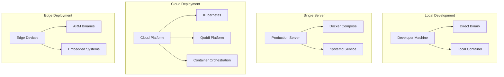
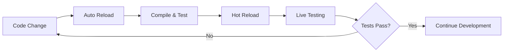
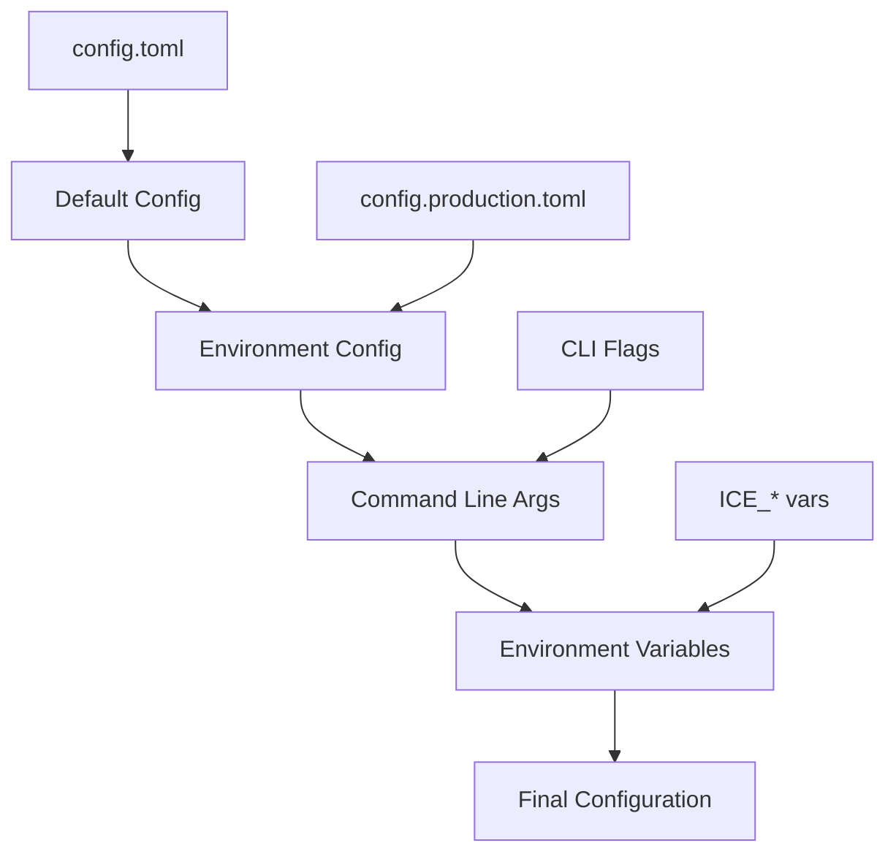
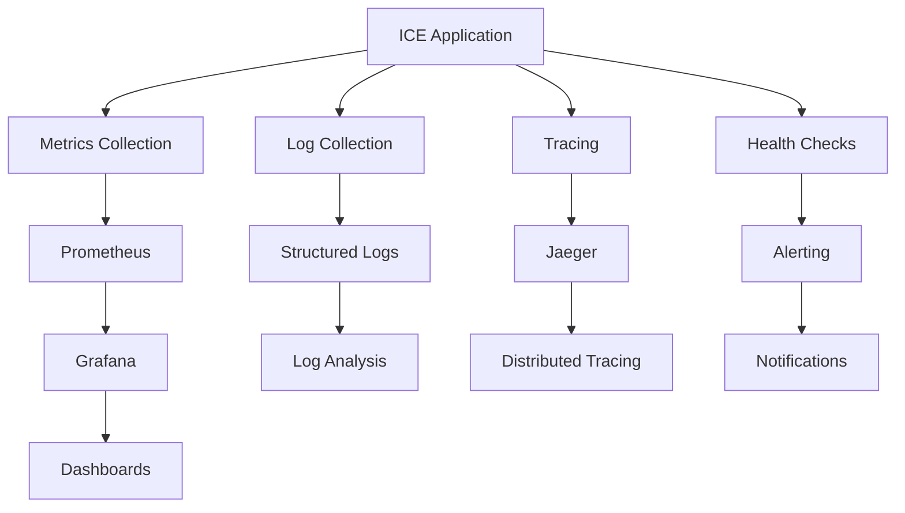
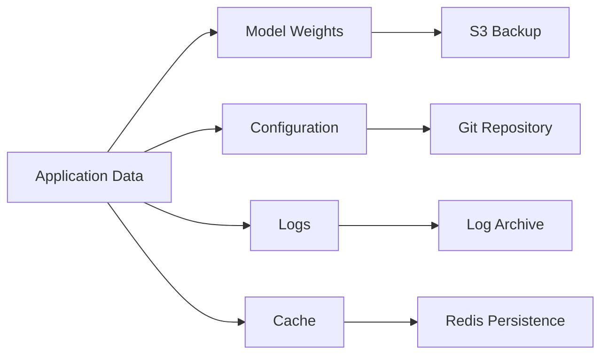

# Deployment & Configuration Documentation 🚀

## Overview

This document provides comprehensive deployment guidance for ICE (Intelligent Compact Engine), covering local development, production deployment, containerization, CI/CD pipelines, and configuration management.

## Quick Start Deployment

### Prerequisites

```bash
# Required tools
- Rust 1.80+ (rustup.rs)
- Zig 0.13+ (ziglang.org)
- Go 1.23+ (golang.org)
- Docker 24.0+ (optional)
- CUDA 12.0+ (training only)

# System requirements
- CPU: 4+ cores (Intel i5/AMD Ryzen 5 or better)
- RAM: 8GB+ (16GB recommended)
- Storage: 10GB+ free space
- GPU: RTX 2070 Ti or equivalent (training only)
```

### One-Command Setup

```bash
# Clone and setup development environment
git clone https://github.com/DeanT-04/ICE.git
cd ICE
make quick-start
```

## Deployment Architectures

### Architecture Options



## Local Development

### Development Environment Setup

```bash
# Install dependencies
make dev-setup

# Setup development environment
make dev-env

# Start development server
make dev
```

### Development Configuration

**File**: [`config.toml`](../config.toml)

```toml
[environment]
mode = "development"
log_level = "debug"
hot_reload = true

[model]
max_parameters = 100_000_000
inference_timeout_ms = 5000
enable_debugging = true

[server]
host = "127.0.0.1"
port = 8080
workers = 4

[mcp]
servers = [
    "mcp-server-api",
    "mcp-server-tools", 
    "mcp-server-data",
    "mcp-server-feedback"
]
cache_enabled = true
cache_ttl_seconds = 3600

[performance]
target_latency_ms = 100
target_power_w = 50
memory_limit_gb = 8
```

### Development Workflow



### Development Commands

```bash
# Build all components
make build                 # Production build
make build-dev            # Development build with debug symbols

# Run tests
make test                 # All tests
make test-unit           # Unit tests only
make test-integration    # Integration tests only
make test-watch          # Continuous testing

# Code quality
make lint                # Lint all languages
make format              # Format all code
make check               # Static analysis

# Development server
make dev                 # Start development server
make dev-api            # API server only
make dev-mcp            # MCP servers only
```

## Production Deployment

### Production Configuration

**File**: `config.production.toml`

```toml
[environment]
mode = "production"
log_level = "info"
metrics_enabled = true

[model]
max_parameters = 100_000_000
inference_timeout_ms = 2000
batch_size = 32

[server]
host = "0.0.0.0"
port = 8080
workers = 8
max_connections = 1000

[security]
auth_required = true
rate_limiting = true
max_requests_per_minute = 1000
cors_enabled = false

[performance]
target_latency_ms = 100
target_power_w = 50
memory_limit_gb = 8
enable_metrics = true

[monitoring]
prometheus_endpoint = "0.0.0.0:9090"
health_check_interval = 30
log_to_file = true
log_file = "/var/log/ice/ice.log"
```

### Systemd Service

**File**: `/etc/systemd/system/ice.service`

```ini
[Unit]
Description=ICE Hyper-Efficient AI Model
After=network.target
Requires=network.target

[Service]
Type=simple
User=ice
Group=ice
WorkingDirectory=/opt/ice
ExecStart=/opt/ice/target/release/ice --config /etc/ice/config.production.toml
ExecReload=/bin/kill -HUP $MAINPID
Restart=always
RestartSec=5
StandardOutput=journal
StandardError=journal
SyslogIdentifier=ice

# Security
NoNewPrivileges=true
PrivateTmp=true
ProtectSystem=strict
ProtectHome=true
ReadWritePaths=/var/log/ice /var/cache/ice

# Resource limits
LimitNOFILE=65536
MemoryLimit=8G
CPUQuota=400%

[Install]
WantedBy=multi-user.target
```

### Production Commands

```bash
# Install as system service
sudo make install-service

# Service management
sudo systemctl start ice
sudo systemctl enable ice
sudo systemctl status ice

# Monitoring
sudo journalctl -u ice -f
tail -f /var/log/ice/ice.log

# Updates
sudo systemctl stop ice
make build-release
sudo make update-service
sudo systemctl start ice
```

## Container Deployment

### Docker Configuration

#### Multi-Stage Dockerfile

**File**: [`Dockerfile`](../Dockerfile)

```dockerfile
# Multi-stage build for efficiency
FROM rust:1.80-slim AS rust-builder
WORKDIR /app
COPY Cargo.toml Cargo.lock ./
COPY src/ ./src/
RUN cargo build --release

FROM ziglang/zig:0.13 AS zig-builder
WORKDIR /app
COPY build.zig ./
COPY src/kernels/ ./src/kernels/
RUN zig build -Doptimize=ReleaseFast

FROM golang:1.23-alpine AS go-builder
WORKDIR /app
COPY go.mod go.sum ./
COPY src/mcp/ ./src/mcp/
RUN go build -o mcp-servers ./src/mcp/

# Runtime stage
FROM gcr.io/distroless/cc-debian12
COPY --from=rust-builder /app/target/release/ice /usr/local/bin/
COPY --from=zig-builder /app/zig-out/lib/ /usr/local/lib/
COPY --from=go-builder /app/mcp-servers /usr/local/bin/
COPY config.production.toml /etc/ice/config.toml

# Non-root execution
USER 1000:1000
EXPOSE 8080
HEALTHCHECK --interval=30s --timeout=10s --start-period=5s --retries=3 \
  CMD ["/usr/local/bin/ice", "--health-check"]

ENTRYPOINT ["/usr/local/bin/ice"]
CMD ["--config", "/etc/ice/config.toml"]
```

#### Docker Build & Run

```bash
# Build production image
docker build -t ice:latest .
docker build -t ice:1.0.0 .

# Run container
docker run -d \
  --name ice \
  -p 8080:8080 \
  -v /var/log/ice:/var/log/ice \
  -v /var/cache/ice:/var/cache/ice \
  --memory=8g \
  --cpus=4 \
  ice:latest

# Run with GPU support (training)
docker run -d \
  --name ice-training \
  --gpus all \
  -p 8080:8080 \
  -v ./datasets:/app/datasets \
  ice:latest --mode training
```

### Docker Compose

**File**: [`docker-compose.yml`](../docker-compose.yml)

```yaml
version: '3.8'

services:
  ice:
    build: .
    ports:
      - "8080:8080"
      - "9090:9090"  # Metrics
    environment:
      - ICE_CONFIG=/etc/ice/config.toml
      - ICE_LOG_LEVEL=info
    volumes:
      - ./config.production.toml:/etc/ice/config.toml:ro
      - ice-logs:/var/log/ice
      - ice-cache:/var/cache/ice
    deploy:
      resources:
        limits:
          memory: 8G
          cpus: '4'
        reservations:
          memory: 4G
          cpus: '2'
    healthcheck:
      test: ["CMD", "/usr/local/bin/ice", "--health-check"]
      interval: 30s
      timeout: 10s
      retries: 3
    restart: unless-stopped

  # Training environment with GPU
  ice-training:
    build: .
    command: ["--mode", "training"]
    ports:
      - "8081:8080"
    environment:
      - CUDA_VISIBLE_DEVICES=0
    volumes:
      - ./datasets:/app/datasets
      - ./models:/app/models
      - training-logs:/var/log/ice
    deploy:
      resources:
        limits:
          memory: 16G
        reservations:
          devices:
            - driver: nvidia
              count: 1
              capabilities: [gpu]
    profiles:
      - training

  # Redis cache (optional)
  redis:
    image: redis:7-alpine
    ports:
      - "6379:6379"
    volumes:
      - redis-data:/data
    command: redis-server --appendonly yes --maxmemory 256mb
    restart: unless-stopped
    profiles:
      - cache

  # Monitoring
  prometheus:
    image: prom/prometheus:latest
    ports:
      - "9091:9090"
    volumes:
      - ./monitoring/prometheus.yml:/etc/prometheus/prometheus.yml:ro
      - prometheus-data:/prometheus
    command:
      - '--config.file=/etc/prometheus/prometheus.yml'
      - '--storage.tsdb.path=/prometheus'
      - '--web.console.libraries=/etc/prometheus/console_libraries'
      - '--web.console.templates=/etc/prometheus/consoles'
    profiles:
      - monitoring

  grafana:
    image: grafana/grafana:latest
    ports:
      - "3000:3000"
    environment:
      - GF_SECURITY_ADMIN_PASSWORD=admin
    volumes:
      - grafana-data:/var/lib/grafana
      - ./monitoring/grafana:/etc/grafana/provisioning
    profiles:
      - monitoring

volumes:
  ice-logs:
  ice-cache:
  training-logs:
  redis-data:
  prometheus-data:
  grafana-data:

networks:
  default:
    driver: bridge
```

### Docker Compose Commands

```bash
# Production deployment
docker-compose up -d

# With monitoring
docker-compose --profile monitoring up -d

# With training support
docker-compose --profile training up -d

# Full stack
docker-compose --profile monitoring --profile training --profile cache up -d

# Scaling
docker-compose up -d --scale ice=3

# Updates
docker-compose pull
docker-compose up -d

# Logs
docker-compose logs -f ice
```

## Kubernetes Deployment

### Kubernetes Manifests

#### Deployment

**File**: `k8s/deployment.yaml`

```yaml
apiVersion: apps/v1
kind: Deployment
metadata:
  name: ice
  labels:
    app: ice
spec:
  replicas: 3
  selector:
    matchLabels:
      app: ice
  template:
    metadata:
      labels:
        app: ice
    spec:
      containers:
      - name: ice
        image: ice:1.0.0
        ports:
        - containerPort: 8080
        - containerPort: 9090
        env:
        - name: ICE_CONFIG
          value: "/etc/ice/config.toml"
        resources:
          requests:
            memory: "4Gi"
            cpu: "2"
          limits:
            memory: "8Gi"
            cpu: "4"
        volumeMounts:
        - name: config
          mountPath: /etc/ice
          readOnly: true
        - name: cache
          mountPath: /var/cache/ice
        livenessProbe:
          httpGet:
            path: /api/v1/health
            port: 8080
          initialDelaySeconds: 30
          periodSeconds: 10
        readinessProbe:
          httpGet:
            path: /api/v1/health
            port: 8080
          initialDelaySeconds: 5
          periodSeconds: 5
      volumes:
      - name: config
        configMap:
          name: ice-config
      - name: cache
        emptyDir: {}
```

#### Service

**File**: `k8s/service.yaml`

```yaml
apiVersion: v1
kind: Service
metadata:
  name: ice-service
spec:
  selector:
    app: ice
  ports:
  - name: api
    port: 80
    targetPort: 8080
  - name: metrics
    port: 9090
    targetPort: 9090
  type: LoadBalancer
```

#### ConfigMap

**File**: `k8s/configmap.yaml`

```yaml
apiVersion: v1
kind: ConfigMap
metadata:
  name: ice-config
data:
  config.toml: |
    [environment]
    mode = "production"
    log_level = "info"
    
    [model]
    max_parameters = 100_000_000
    inference_timeout_ms = 2000
    
    [server]
    host = "0.0.0.0"
    port = 8080
    workers = 8
    
    [performance]
    target_latency_ms = 100
    target_power_w = 50
    memory_limit_gb = 8
```

#### Horizontal Pod Autoscaler

**File**: `k8s/hpa.yaml`

```yaml
apiVersion: autoscaling/v2
kind: HorizontalPodAutoscaler
metadata:
  name: ice-hpa
spec:
  scaleTargetRef:
    apiVersion: apps/v1
    kind: Deployment
    name: ice
  minReplicas: 2
  maxReplicas: 10
  metrics:
  - type: Resource
    resource:
      name: cpu
      target:
        type: Utilization
        averageUtilization: 70
  - type: Resource
    resource:
      name: memory
      target:
        type: Utilization
        averageUtilization: 80
```

### Kubernetes Commands

```bash
# Deploy to Kubernetes
kubectl apply -f k8s/

# Check status
kubectl get pods -l app=ice
kubectl get svc ice-service

# Scaling
kubectl scale deployment ice --replicas=5

# Rolling update
kubectl set image deployment/ice ice=ice:1.1.0

# Monitoring
kubectl logs -f deployment/ice
kubectl top pods

# Port forwarding (development)
kubectl port-forward service/ice-service 8080:80
```

## CI/CD Pipeline

### Qoddi Platform Configuration

**File**: [`.qoddi.yaml`](../.qoddi.yaml)

```yaml
name: ICE Hyper-Efficient AI Model
version: 1.0.0

build:
  commands:
    - make install-deps
    - make build-all
    - make test-all
    - make security-scan
  
deploy:
  type: container
  dockerfile: Dockerfile
  
environment:
  - ICE_CONFIG=/etc/ice/config.toml
  - ICE_LOG_LEVEL=info

resources:
  memory: 8GB
  cpu: 4
  storage: 20GB

health_check:
  path: /api/v1/health
  interval: 30
  timeout: 10

scaling:
  min_instances: 1
  max_instances: 5
  cpu_threshold: 70
  memory_threshold: 80

monitoring:
  metrics_endpoint: /metrics
  log_level: info
  alerts:
    - condition: response_time > 200ms
      action: scale_up
    - condition: error_rate > 5%
      action: alert
```

### GitHub Actions Workflow

**File**: `.github/workflows/ci-cd.yml`

```yaml
name: CI/CD Pipeline

on:
  push:
    branches: [ main, develop ]
  pull_request:
    branches: [ main ]

env:
  CARGO_TERM_COLOR: always
  RUST_BACKTRACE: 1

jobs:
  test:
    runs-on: ubuntu-latest
    strategy:
      matrix:
        rust: [stable, beta]
        
    steps:
    - uses: actions/checkout@v4
    
    - name: Install Rust
      uses: actions-rs/toolchain@v1
      with:
        toolchain: ${{ matrix.rust }}
        override: true
        components: rustfmt, clippy
    
    - name: Install Zig
      uses: mlugg/setup-zig@v1
      with:
        version: 0.13.0
    
    - name: Install Go
      uses: actions/setup-go@v4
      with:
        go-version: '1.23'
    
    - name: Cache dependencies
      uses: actions/cache@v3
      with:
        path: |
          ~/.cargo/registry
          ~/.cargo/git
          target/
        key: ${{ runner.os }}-cargo-${{ hashFiles('**/Cargo.lock') }}
    
    - name: Lint
      run: make lint
    
    - name: Build
      run: make build
    
    - name: Test
      run: make test
    
    - name: Security Scan
      run: make security-scan
    
    - name: Coverage
      run: |
        cargo install cargo-tarpaulin
        cargo tarpaulin --out Xml
    
    - name: Upload Coverage
      uses: codecov/codecov-action@v3
      with:
        file: ./cobertura.xml

  build-and-deploy:
    needs: test
    runs-on: ubuntu-latest
    if: github.ref == 'refs/heads/main'
    
    steps:
    - uses: actions/checkout@v4
    
    - name: Build Docker Image
      run: |
        docker build -t ice:${{ github.sha }} .
        docker tag ice:${{ github.sha }} ice:latest
    
    - name: Deploy to Qoddi
      uses: qoddi/deploy-action@v1
      with:
        api_key: ${{ secrets.QODDI_API_KEY }}
        project_id: ${{ secrets.QODDI_PROJECT_ID }}
        image: ice:${{ github.sha }}
```

## Configuration Management

### Configuration Hierarchy



### Environment-Specific Configurations

#### Development (`config.dev.toml`)
```toml
[environment]
mode = "development"
log_level = "debug"
hot_reload = true

[model]
enable_debugging = true
inference_timeout_ms = 10000

[performance]
strict_limits = false
```

#### Testing (`config.test.toml`)
```toml
[environment]
mode = "test"
log_level = "error"

[model]
max_parameters = 1_000_000  # Smaller for tests
inference_timeout_ms = 1000

[server]
port = 0  # Random port
```

#### Production (`config.production.toml`)
```toml
[environment]
mode = "production"
log_level = "info"

[security]
auth_required = true
rate_limiting = true

[performance]
strict_limits = true
enable_metrics = true
```

### Environment Variables

```bash
# Core configuration
export ICE_CONFIG=/path/to/config.toml
export ICE_LOG_LEVEL=info
export ICE_MODE=production

# Model configuration
export ICE_MAX_PARAMETERS=100000000
export ICE_INFERENCE_TIMEOUT=2000

# Server configuration
export ICE_HOST=0.0.0.0
export ICE_PORT=8080
export ICE_WORKERS=8

# Security
export ICE_AUTH_TOKEN=your-secret-token
export ICE_RATE_LIMIT=1000

# External services
export GITHUB_TOKEN=your-github-token
export HF_TOKEN=your-huggingface-token
export OPENAI_API_KEY=your-openai-key

# Monitoring
export PROMETHEUS_ENDPOINT=http://localhost:9090
export GRAFANA_ENDPOINT=http://localhost:3000
```

## Monitoring & Observability

### Monitoring Stack



### Prometheus Configuration

**File**: `monitoring/prometheus.yml`

```yaml
global:
  scrape_interval: 15s
  evaluation_interval: 15s

scrape_configs:
  - job_name: 'ice'
    static_configs:
      - targets: ['localhost:9090']
    metrics_path: /metrics
    scrape_interval: 5s

  - job_name: 'ice-mcp'
    static_configs:
      - targets: ['localhost:9091']
    metrics_path: /metrics
    scrape_interval: 10s

rule_files:
  - "alert_rules.yml"

alerting:
  alertmanagers:
    - static_configs:
        - targets:
          - alertmanager:9093
```

### Grafana Dashboard

```json
{
  "dashboard": {
    "title": "ICE Performance Dashboard",
    "panels": [
      {
        "title": "Inference Latency",
        "type": "graph",
        "targets": [
          {
            "expr": "histogram_quantile(0.95, ice_inference_duration_seconds_bucket)",
            "legendFormat": "p95"
          }
        ]
      },
      {
        "title": "Power Consumption",
        "type": "graph",
        "targets": [
          {
            "expr": "ice_power_consumption_watts",
            "legendFormat": "Power (W)"
          }
        ]
      }
    ]
  }
}
```

## Backup & Recovery

### Backup Strategy



### Backup Commands

```bash
# Model backup
make backup-models

# Configuration backup
git add config/
git commit -m "Update configuration"
git push

# Full system backup
./scripts/backup.sh

# Automated backup (cron)
0 2 * * * /opt/ice/scripts/backup.sh
```

### Recovery Procedures

```bash
# Restore from backup
./scripts/restore.sh /backup/ice-2024-01-15.tar.gz

# Model recovery
make restore-models

# Configuration recovery
git checkout HEAD~1 -- config/

# Emergency recovery
docker run --rm -v ice-backup:/backup ice:latest restore
```

## Troubleshooting

### Common Issues

| Issue | Symptoms | Solution |
|-------|----------|----------|
| **High Latency** | Response time > 200ms | Check resource limits, scale horizontally |
| **Memory Errors** | OOM kills, crashes | Increase memory limits, optimize batch size |
| **Build Failures** | Compilation errors | Check dependencies, clean rebuild |
| **GPU Issues** | Training failures | Verify CUDA installation, check drivers |

### Diagnostic Commands

```bash
# System diagnostics
make diagnose

# Performance profiling
make profile

# Memory analysis
make memory-check

# Resource monitoring
make monitor

# Log analysis
make log-analysis
```

### Debug Mode

```bash
# Start in debug mode
ICE_LOG_LEVEL=debug cargo run -- --debug

# Enable profiling
cargo run --features profiling

# Memory debugging
RUST_BACKTRACE=full cargo run
```

This comprehensive deployment documentation covers all aspects of deploying and managing ICE in various environments, from local development to production Kubernetes clusters.